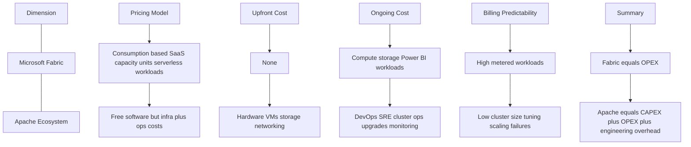

```mermaid
flowchart TB
    A[Dimension] --- B[Microsoft Fabric] --- C[Apache Ecosystem]

    D1[Pricing Model] --> D2[Consumption based SaaS capacity units serverless workloads] --> D3[Free software but infra plus ops costs]
    E1[Upfront Cost] --> E2[None] --> E3[Hardware VMs storage networking]
    F1[Ongoing Cost] --> F2[Compute storage Power BI workloads] --> F3[DevOps SRE cluster ops upgrades monitoring]
    G1[Billing Predictability] --> G2[High metered workloads] --> G3[Low cluster size tuning scaling failures]

    H1[Summary] --> H2[Fabric equals OPEX] --> H3[Apache equals CAPEX plus OPEX plus engineering overhead]
```
