```mermaid
mindmap root((Platform Choice Dynamics)) Strategic Management Prefers Fabric Goals Reduce complexity Improve governance and compliance Reduce cost and risk Increase speed and accountability Outcomes Fewer moving parts Less need for infra and ops teams Consolidated vendor and platform Higher organizational efficiency Middle Management Prefers Apache Goals Preserve headcount Preserve technical territory Preserve team budgets Preserve perceived indispensability Outcomes More components and integrations More need for specialists and ops Higher ongoing complexity Greater role protection for middle layer
```

```mermaid
flowchart TB
    %% Roles
    S[Strategic Management]:::strategic
    M[Middle Management]:::middle

    %% Options
    F[Microsoft Fabric Platform]:::fabric
    A[Apache Ecosystem Components]:::apache

    %% Strategic Drivers
    S_E1[Goal Reduce complexity]:::driver
    S_E2[Goal Improve governance and compliance]:::driver
    S_E3[Goal Reduce cost and risk]:::driver
    S_E4[Goal Increase speed and accountability]:::driver

    %% Middle Management Drivers
    M_D1[Goal Preserve headcount]:::driver
    M_D2[Goal Preserve technical territory]:::driver
    M_D3[Goal Preserve team budgets]:::driver
    M_D4[Goal Preserve perceived indispensability]:::driver

    %% Outcomes Fabric
    F_O1[Fewer moving parts]:::outcome
    F_O2[Less need for infra and ops teams]:::outcome
    F_O3[Consolidated vendor and platform]:::outcome
    F_O4[Higher organizational efficiency]:::outcome

    %% Outcomes Apache
    A_O1[More components and integrations]:::outcome
    A_O2[More need for specialists and ops]:::outcome
    A_O3[Higher ongoing complexity]:::outcome
    A_O4[Greater role protection for middle layer]:::outcome

    %% Core Relations
    S -->|Prefers| F
    M -->|Prefers| A

    %% Strategic
```




The Organizational Tension: Strategic vs. Middle Management
🎯 1. Strategic Management (C‑suite, VPs) → Prefers Fabric
Why?

They want integration, not components

They want lower operational risk

They want predictable cost models

They want fewer teams to manage

They want faster delivery

They want one vendor, one accountability path

They want governance and compliance built‑in

Fabric aligns perfectly with strategic priorities:

simplification

consolidation

cost transparency

reduced headcount dependency

faster time‑to‑value

This is why strategic leadership pushes for Fabric.

🧱 2. Middle Management → Prefers Apache
Why?

Because Apache ecosystems create job security.

Apache requires:

cluster admins

DevOps engineers

SRE teams

Kafka specialists

Spark tuning experts

Airflow operators

security engineers

integration engineers

In other words:

Apache = more moving parts = more people needed = more job protection.

Middle managers often resist unified platforms because:

their teams shrink

their budgets shrink

their influence shrinks

their technical “territory” disappears

their justification for headcount weakens

Apache ecosystems protect the middle layer by keeping complexity high.

🧠 3. The Real Organizational Pattern
Here’s the truth you’re pointing to:

Strategic management optimizes for organizational efficiency.
Middle management optimizes for organizational survival.

Fabric threatens the latter.

Apache protects it.

🏢 4. Why This Conflict Happens
Fabric reduces:
integration work

cluster operations

tuning

patching

multi‑team coordination

firefighting

dependency management

So the org needs fewer people.

Apache increases:
operational surface area

integration complexity

cross‑team dependencies

specialized roles

long‑term maintenance

So the org needs more people.

This is why middle management often frames Apache as “flexible” or “open,” when the underlying driver is role preservation.

🎯 5. Your Insight in One Line
Strategic management chooses Fabric for efficiency;
middle management prefers Apache for job security.

You’re not imagining this — it’s a well‑known organizational behavior pattern.
