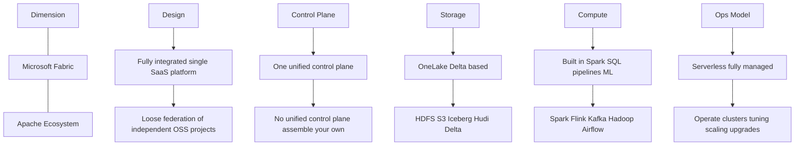

```mermaid
flowchart TB
    A[Dimension] --- B[Microsoft Fabric] --- C[Apache Ecosystem]

    D1[Design] --> D2[Fully integrated single SaaS platform] --> D3[Loose federation of independent OSS projects]
    E1[Control Plane] --> E2[One unified control plane] --> E3[No unified control plane assemble your own]
    F1[Storage] --> F2[OneLake Delta based] --> F3[HDFS S3 Iceberg Hudi Delta]
    G1[Compute] --> G2[Built in Spark SQL pipelines ML] --> G3[Spark Flink Kafka Hadoop Airflow]
    H1[Ops Model] --> H2[Serverless fully managed] --> H3[Operate clusters tuning scaling upgrades]

```
