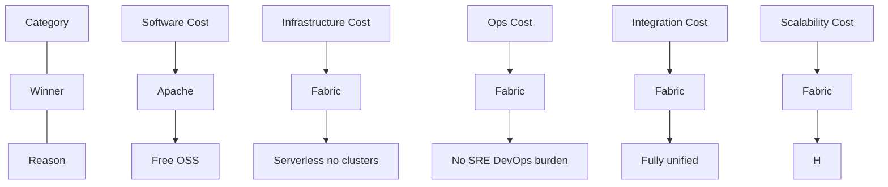

```mermaid
flowchart TB
    A[Category] --- B[Winner] --- C[Reason]

    D1[Software Cost] --> D2[Apache] --> D3[Free OSS]
    E1[Infrastructure Cost] --> E2[Fabric] --> E3[Serverless no clusters]
    F1[Ops Cost] --> F2[Fabric] --> F3[No SRE DevOps burden]
    G1[Integration Cost] --> G2[Fabric] --> G3[Fully unified]
    H1[Scalability Cost] --> H2[Fabric] --> H
```
